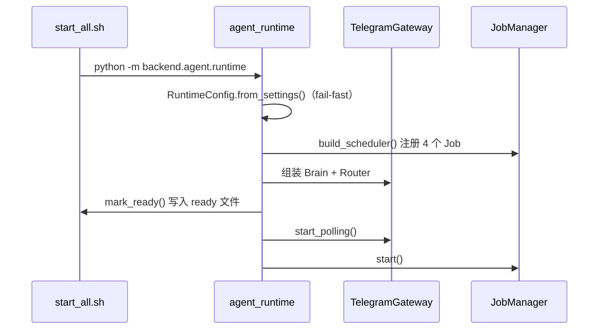
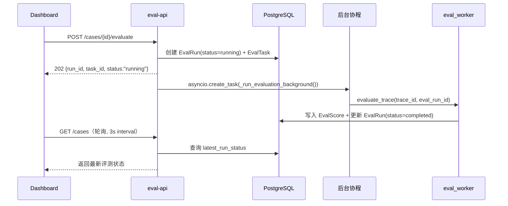

# Eval开发日记-2: 引入 Agent Runtime，让 7×24 Agent 自己跑起来

## 1. Agent Runtime：独立于 uvicorn 的常驻进程

新增 `backend/agent/runtime.py`，这是一个独立 asyncio 进程，承载 Telegram Gateway 和 Scheduler。

为什么不能挂到 uvicorn 里？

```text
uvicorn --reload  →  多 worker 模式下 polling 重复触发
                   →  长连接与 HTTP 生命周期混在一起，难以管理
                   →  scheduler 在 reload 时状态丢失，任务会被重复注册
```

Runtime 的设计要点：

- 通过 `signal.SIGINT/SIGTERM` 优雅退出
- 通过 `AGENT_RUNTIME_READY_FILE` 文件与 `start_all.sh` 通信，告知初始化完成
- Gateway 挂了不影响评测 API，反之亦然——故障隔离



## 2. Agent Brain：意图解析 → 命令执行

`backend/agent/brain/` 是决策核心，拆成四个模块：

| 模块 | 职责 |
|------|------|
| `parser.py` | LLM 意图解析，将自然语言消息映射到注册命令 |
| `registry.py` | 函数注册表，管理所有可调用工具 |
| `executor.py` | 命令执行器，处理上下文注入、参数校验、历史维护 |
| `tools/` | 三组工具：`actions`（执行操作）、`queries`（查询数据）、`reports`（生成报告） |

设计上遵循"大脑上提"原则：Gateway 只负责收发消息，真正路由和决策都在 Brain 层完成。三种工具分组对应不同的 LLM 调用模式：

- **queries**：读操作，LLM 辅助理解意图，SQL/API 确定性执行
- **actions**：写操作，需要二次确认或权限校验
- **reports**：纯 LLM 生成，结果直接返回用户

这让 LLM Parser 在意图识别时有更清晰的决策边界。

## 3. Telegram Gateway：polling 模式接入

`backend/agent/gateway/telegram.py` 实现了 Telegram Bot API 的 long polling 接入：

- **白名单校验**：`TELEGRAM_ALLOWED_USERS` 逗号分隔，非白名单用户静默忽略
- **速率限制**：`ratelimit.py` 提供基于用户 ID 的滑动窗口限流
- **消息路由**：`router.py` 将 Telegram Update 转为标准化 `GatewayMessage`
- **双模式预留**：当前 polling，Gateway 基类已预留 webhook 扩展点

配置 fail-fast 策略：Token 或白名单为空直接拒绝启动，不给半运行状态留余地。

## 4. Scheduler：定时任务框架

`backend/agent/scheduler/` 实现基于 asyncio 的轻量调度器：

```text
JobManager
├── SamplingJob        # 按比例抽样 Trace
├── DailySamplingJob   # 每日定时抽样（限额 + 比例双控）
├── DailyReportJob     # 每日评测报告生成
└── AlertCheckJob      # 告警检查（异常评测结果通知）
```

每个 Job 独立调度，异常隔离——一个 Job 抛异常不影响其他 Job。调度状态通过 `AgentJobRun` 模型持久化到 PostgreSQL。

## 5. 评测异步化：API 不再阻塞

这是对评测链路最关键的改进。

**改之前**：`POST /api/cases/{case_id}/evaluate` 同步执行评测，LLM Judge 场景下耗时 5-30 秒，HTTP 一直等到评分结束才返回。

**改之后**：



三个关键设计决策：

1. **`eval_run_id` 精确查询**：`eval_worker` 优先通过传入的 `eval_run_id` 定位 EvalRun，而不是取 trace 下"最新一条"。避免并发提交时取错 Run 的竞态问题。
2. **`orchestrator.run()` 线程池化**：原来同步阻塞调用会卡住整个事件循环，现在通过 `loop.run_in_executor()` 放入线程池执行。
3. **`completed_at` 时间戳**：EvalRun 新增 `completed_at` 字段，方便后续做耗时分析和 SLA 监控。

## 6. Dashboard 实时轮询

Case 列表新增"评测状态"列，三种状态展示：

| 状态 | 展示 |
|------|------|
| `running` | 橙色脉冲动画 + spinner + "评测中" |
| `completed` | 绿色 ✓ 完成 |
| `failed` | 红色 ✗ 失败 |

体验优化：

- 点击"评分"后按钮立即变为 disabled + spinner，即时反馈
- 自动检测 running 中的 Case，有则启动 3 秒间隔轮询
- 所有 Case 完成后自动停轮询，减少无效请求
- 轮询结束时自动刷新分数和运行次数

典型的"乐观 UI + 后台轮询"模式。

## 7. 启动脚本重构

`scripts/start_all.sh` 从 4 步扩展到 7 步，主要新增：

- **环境变量加载**：启动前自动 `source backend/.env`
- **Agent Runtime 配置预检**：`python -m backend.agent.runtime --check-config`，验证 Token、白名单、模式
- **独立日志目录**：所有服务日志统一写入 `logs/`
- **Ready 文件机制**：Runtime 初始化完成后写 `/tmp/agent-eval/agent_runtime.ready`
- **旧进程清理**：`stop_all()` 增加 `agent_runtime` 进程的 kill 逻辑

## 8. 测试覆盖

5 个新测试文件，约 2800 行测试代码：

| 测试文件 | 行数 | 覆盖范围 |
|----------|------|----------|
| `test_brain.py` | 528 | 意图解析、命令注册、执行器 |
| `test_gateway.py` | 832 | Telegram 消息解析、路由、限流 |
| `test_integration.py` | 748 | Gateway → Brain 端到端链路 |
| `test_runtime.py` | 132 | Runtime 启动/停止生命周期 |
| `test_scheduler.py` | 567 | Job 注册、调度、异常隔离 |

测试行数已经超过第一次提交的整个项目规模。7×24 常驻服务不像 HTTP 接口有超时兜底，测试必须更充分。

## 9. 架构取舍

### 为什么 asyncio 而不是 Celery？

评测链路其实也适合 Celery，但 Gateway 和 Scheduler 是天然的长连接/常驻组件，asyncio 更合适。技术栈统一优先，后续任务量上来再考虑迁移。

### 为什么 Telegram polling 而不是 webhook？

Polling 不需要公网 HTTPS 端点，本地开发简单。Gateway 基类已预留 webhook 扩展点，切生产只改配置。

### 为什么 Brain 工具分三组？

`actions` / `queries` / `reports` 对应三种 LLM 调用模式——读、写、生成，让 LLM Parser 在意图识别时有清晰的决策边界。

## 10. 待补项

1. `orchestrator.run()` 线程池无上限，大量并发可能创建过多线程，应加 `ThreadPoolExecutor(max_workers=N)`
2. Dashboard 轮询是 3 秒固定间隔，Case 多时 GET /cases 批量查询开销需关注
3. Scheduler 缺少运行时健康检查接口（每个 Job 的上次执行时间和状态）
4. Telegram 消息未持久化，Runtime 重启后会话上下文丢失，建议用 Redis 做会话缓存

## 总结

这次提交把这个项目从"评测工具"升级为"可评测的 Agent 服务"——系统既能在线上运行 Agent，也能对 Agent 的每一次运行做全链路评测。

前面几轮在回答"如何评测 Agent"，这一轮在回答"如何让被评测的 Agent 持续运行"。两者合在一起，才是 7×24 Agent 的完整工程闭环。
