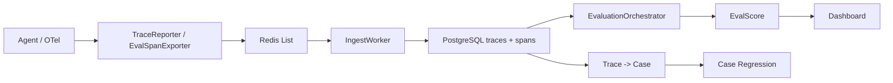

# 从 Trace 可观测到自动化评测闭环

## 1. 第一阶段：先让 Agent 链路跑起来

`081571c` 这次提交做了两件事。

第一，新增了 `examples/example_agent.py` 和 `examples/agent_server.py`。

`ExampleAgent` 被拆成了几个可观测阶段：

```text
intent -> retrieval -> tool_call -> generation -> outcome
```

每个阶段都会通过 `TraceReporter` 上报 span。这样一次 Agent 运行不再只是一个最终答案，而是一条可以追踪的执行链路。

第二，修复了 `IngestWorker` 的稳定性问题。

这次改动里有两个关键点：

- Redis async 连接关闭从 `close()` 改成 `aclose()`
- 消费 Redis 事件时增加 `trace_id` / `run_id` 的 UUID 校验

这个修复很工程化。长期运行的消费者最怕一条脏数据把整批消费打挂。这里选择“跳过非法事件 + 打日志”，比直接抛异常更适合 7*24 场景。

同时，ORM 关系里也补了 `primaryjoin`。因为部分字段没有强外键约束，需要 SQLAlchemy 明确知道关联条件。这是为了保留历史评测数据，不让 Case 或 Trace 的生命周期强绑定所有运行记录。

## 2. 第二阶段：清理工程边界

`7b0e361` 删除了 `.qoder/plan.md`、`.qoder/rules/workflow-enforcement.md` 和旧的 `docker-compose.yml`。

这次提交不是功能开发，但它说明项目开始收束边界：哪些是项目真正要维护的代码，哪些是历史工作流残留，都要分清楚。

不过这里也留下一个后续需要复核的点：后面的 `scripts/start_all.sh` 仍然假设可以执行 `docker compose up -d redis postgres`。如果 `docker-compose.yml` 已经删除，启动脚本和基础设施描述需要重新对齐。

这类问题不是业务 bug，但会影响新人启动、CI 验证和本地复现。

## 3. 第三阶段：从 Trace 走向评测平台

`f4ecb7f` 是最近四次提交里最大的主体。

这次引入了几条核心能力。

### 3.1 OpenTelemetry 适配

新增了 `EvalSpanExporter`，目标是让 LangChain、LlamaIndex、OpenAI Agents SDK 这类已有 OTel 埋点的框架可以低侵入接入评测系统。

`span_type` 映射采用三层策略：

```text
eval.span_type 显式标注
-> span.name 模式匹配
-> 原始 span.name 兜底
```

这个设计务实。显式标注最准确，模式匹配降低接入成本，兜底保证数据不丢。

测试里还专门覆盖了一个边界：`stool` 包含 `tool`，会被误判成 `tool_call`。这说明作者清楚 substring matching 的风险，并把它变成了可见的测试约束。

### 3.2 LLM Judge 进入生成层评测

新增了 `backend/runner/llm_judge.py`，封装 OpenAI 兼容 API 调用，支持：

- YAML Prompt 模板
- JSON 响应解析
- markdown code block 剥离
- 指数退避重试
- usage 和 raw response 记录

`GenerationEvaluator` 从原来的确定性规则扩展成混合评测：

- FactualAccuracy
- Completeness
- LanguageQuality
- FormatCompliance
- HallucinationScore
- SemanticSimilarity

其中事实准确性、完整性、幻觉检测可以走 LLM Judge。没有 LLM Judge 时，相关维度会降级跳过，而不是让整个评测失败。

这点很关键：评测系统本身也要可降级。

### 3.3 Case API：把 Trace 变成长期资产

`backend/api/cases.py` 新增了完整 Case 管理能力：

- Case CRUD
- Trace 列表
- Trace 详情
- Trace -> Case
- 单 Case 评分
- Case 历史评分查询

Trace 转 Case 是这轮最重要的产品能力之一。

一次线上 Agent 调用，如果暴露出问题，不能只靠截图或日志复盘。它应该能被沉淀为 Case，后续每次 Agent 版本升级都拿来回归。

这里的设计是：

```text
生产 Trace
-> 保存 query / context / final_response / spans_summary
-> 生成 EvalCase
-> 后续补 expected_snapshot / gold_answer
-> 多轮评分沉淀历史
```

这就把线上问题变成了可执行的质量资产。

### 3.4 多轮评分隔离

这次还新增了 `eval_run_id` 到 `eval_scores`，并通过 Alembic migration 落库。

这个设计解决的是“同一个 Case 多次评分时，评分记录不能串”的问题。

如果只按 `trace_id` 查分数，后面重评、调 Prompt、升级评测器时，很容易把不同轮次的结果混在一起。`eval_run_id` 让每一次评分都有独立边界，这是版本对比和评分回溯的基础。

## 4. 第四阶段：把生成层评测做得更能落地

`8eb0ff2` 更像是对上一轮大功能的补强。

### 4.1 自动补全 `gold_answer` 和 `expected_answer`

`GenerationEvaluator` 覆写了 `evaluate()`，在正式评分前先检查标注是否完整。

如果缺少 `gold_answer`，系统会尝试通过 LLM 生成参考答案。

如果缺少 `expected_answer.check_points`，系统会基于问题和参考答案生成检查点。

这解决了一个现实问题：Case 沉淀速度通常快于人工标注速度。如果每个 Case 都等人工完整标注，评测闭环会很慢。自动标注不能替代人工，但可以作为初筛和冷启动手段。

代码里也记录了 `_annotation_source` 和 `_enriched_expected`，这点很重要。自动生成的标注必须可追溯，不能伪装成人工标准答案。

### 4.2 OTel `trace_finish` 聚合指标

`EvalSpanExporter` 在根 Span 到达时，会对所有子 Span 计算：

- `total_latency_ms`
- `total_tokens`

然后写入 `trace_finish` 事件。

`IngestWorker` 也加了兜底逻辑：如果 finish 事件没有带聚合值，就从已入库 spans 实时计算。

这是典型的双保险设计。上游能算就上游算，上游漏了下游补。对长期运行系统来说，这比单点假设可靠。

### 4.3 Dashboard 从列表变成诊断界面

Dashboard 增加了更丰富的 Trace 详情展示：

- 总分卡片
- 延迟和 token 展示
- span 分布条
- span 链路图
- final response raw / preview 切换
- layer-specific details

这一步让评测结果不只是数据库里的记录，而是能被开发者直接用来定位问题。

Agent 评测平台如果没有可视化，很难进入日常研发流程。

## 5. 这轮开发里的架构主线

从这四次提交看，整体架构可以概括为：



这里的核心不是某个单点功能，而是闭环：

```text
运行 -> 上报 -> 落库 -> 评分 -> 展示 -> 转 Case -> 回归
```

这才是 7*24 Agent 需要的工程基础。

## 6. 开发过程中的几个取舍

### Redis List 而不是直接写数据库

Agent 主链路不能被评测系统拖慢。Redis List 作为缓冲层，让 Agent 只做轻量写入，数据库写入和评测异步处理。

后续如果数据量上来，可以替换成 Kafka 或 Redis Streams，但当前阶段 Redis List 足够简单。

### JSONB 承载快速变化的 Agent 数据

Trace、Span、Prompt、Tool Result 都是变化很快的数据。用 PostgreSQL JSONB 承载这些字段，可以避免频繁改表。

但核心索引字段仍然关系化，比如 version、status、`created_at`、`span_type`。这是稳定查询和灵活演进之间的折中。

### LLM Judge 只做一部分评分

生成层评测接入 LLM Judge，但没有把所有维度都交给模型。

语言质量、格式合规、语义相似度仍保留确定性或半确定性逻辑。这能降低成本，也能避免评测系统完全依赖另一个不稳定模型。

### 先 generation，再补完整五层

最新提交里，`eval_worker` 的 `enabled_layers` 被收敛到了 `["generation"]`，说明当前落地重点转向生成层质量评测。

不过测试文档和部分断言仍保留“五层评测”的预期。这里暴露出一个待收口点：架构目标是五层完整评测，但当前异步执行路径更像 generation-first。

这不是方向错误，而是阶段性实现和最终目标之间还没有完全对齐。

## 7. 我认为还要补的几件事

第一，启动脚本和基础设施文件要重新对齐。删除 `docker-compose.yml` 后，如果脚本仍依赖 compose，需要补新的部署说明或恢复最小 compose。

第二，示例代码里的模型 API Key 必须彻底环境变量化，不能在仓库里保留默认密钥。这是安全底线。

第三，`eval_worker`、E2E 测试和文档里的 `enabled_layers` 预期要统一。否则 CI 会给出错误信号。

第四，Case 评分现在仍偏同步调用，长耗时 LLM Judge 场景下最好改成后台任务或队列化执行。

第五，OTel 的 substring 映射要保留显式覆盖入口。框架越多，误判概率越高，`eval.span_type` 应该成为推荐生产接入方式。

## 8. 复盘

这四次提交体现了一个很清晰的开发节奏：

先跑通链路，再修稳定性；  
先沉淀 Trace，再把 Trace 变 Case；  
先做可观测，再做评测；  
先做单次评分，再考虑版本对比和长期回归。

对 7*24 Agent 来说，最重要的不是一次回答看起来多聪明，而是长期运行后，系统还能回答这几个问题：

- 这次回答为什么失败？
- 是哪一层失败？
- 新版本有没有比旧版本退化？
- 线上问题能不能变成回归用例？
- 评测结果能不能被复查？

这轮开发已经把这些问题的基础设施搭起来了。

下一步要做的是把五层评测路径真正收口，把 Case 回归、版本对比、告警和 CI 集成起来。到那时，这套系统就不只是 Agent 的调试工具，而会变成 Agent 迭代的质量门禁。
